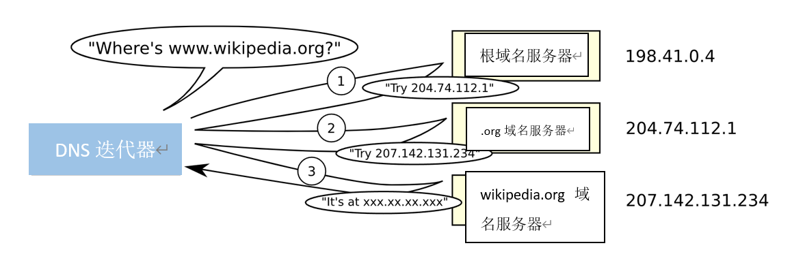

# Web是如何工作的

当我们在浏览器输入框输入 google.com 之后，浏览器中发生了什么事？

**目录**

- [当 Google 的 'g' 键被按下时](#googles-g-key-is-pressed)
- [当你点击 'Enter' 时](#when-you-hit-enter)
- [URL 解析](#parse-the-url)
- [检查 HSTS 列表 (已弃用)](#check-hsts-list-deprecated)
- [DNS 查找](#dns-lookup)
- [开启套接字 + TLS 握手](#opening-of-a-socket--tls-handshake)
- [HTTP 协议](#http-protocol)
- [HTTP 服务器请求句柄](#http-server-request-handle)
- [服务器响应](#server-response)
- [浏览器背后发生的事](#behind-the-scenes-of-the-browser)
- [浏览器的高级结构](#the-browsers-high-level-structure)
- [渲染引擎](#rendering-engine)
- [主工作流](#the-main-flow)
- [解析的基础知识](#parsing-basics)
- [DOM 树](#dom-tree)
  - [为什么 DOM 很慢?](#why-is-the-dom-slow)
- [渲染树](#render-tree)
- [渲染树和 DOM 树之间的关系](#render-trees-relation-to-the-dom-tree)
- [CSS 解析](#css-parsing)
- [布局](#layout)
- [绘制](#painting)
- [其他细枝末节](#trivia)
  - [Web 的诞生](#the-birth-of-the-web)

## 当 Google 的 'g' 键被按下时

当你按下 "g" 键时，浏览器会接收到这个事件，浏览器的自动完成机制会进入高速运转的状态。根据你的浏览器的算法和你是否处于私人、隐身模式，各种各样的建议将会在 URL 栏下方的下拉框中呈现给你。这些搜索建议一般是算法基于你的搜索历史和书签进行优先级排序产生的。但是因为你将要输入的是 "google.com"，所以它们都不重要，但是无论如何，在你输入完成之前，这些算法都会被执行，并且你的每次按键事件都会让它改进建议。它甚至可能在你输入完成之前就建议你搜索 "google.com"。  

## 当你点击 'Enter' 时

输入完毕后，让我们按下键盘上的 “Enter” 键。当你按下它后，一个独属于 “Enter” 键的电路被关闭。这允许一小部分电流流入键盘的逻辑电路，它扫描每个键开关的状态，发现 “Enter” 键发生了不一样的电流变化，并将这个信号转换为一个键码编号，其中 “Enter” 对应的编号是 13。接着，键盘控制器对传输到计算机的键码进行编码。这现在一般是通过通用串行总线（USB）或蓝牙连接来实现的。  

在 USB 键盘的情况下：  

- 键码被内部键盘电路存储在一个名为 “endpoint” 的寄存器中。  
- 主机 USB 控制器大约每 10ms 会轮询一次 “endpoint”，所以它会获取到存储在其中的键码值。
- 这个值会被发送到 USB SIE（串行接口引擎），速度最高为 1.5 Mb/s（在 USB 2.0 协议的情况下）。
- 这个串行信号会被计算机的主机 USB 控制器解码，并被计算机的人机接口设备（HID）通用键盘设备驱动解释。
- 键码值会被传递到操作系统的硬件抽象层。

如果是触摸屏键盘的情况：  

- 当用户在现代的电容式触摸屏上放置手指时，一小撮电流会被传输到手指上。这接通了通过导电层的静电场的电路，并在屏幕上的该点产生了电压降。屏幕控制器会抛出一个中断，报告这个点的坐标。
- 然后，移动操作系统会通知当前在前台运行的应用程序一个点击事件（现在是虚拟键盘应用程序的按钮）。
- 虚拟键盘现在可以抛出一个软件中断，用于向操作系统发送一个 “按键按下” 消息。
- 这个中断会通知当前在前台运行的应用程序一个 “按键按下” 事件。

## URL 解析

现在浏览器已经拥有了 URL（统一资源定位符）中包含的以下信息：  

- “http” 协议：表示使用 “超文本传输协议”
- 资源标识 “/” ：表示获取主页（index）

当没有给出协议或有效的域名时，浏览器会将地址栏中的文本提供给浏览器的默认网络搜索引擎。

## 检查 HSTS 列表 (已弃用)

- ~浏览器检查它的 “预加载的 HSTS（HTTP 严格传输安全）” 列表。这是一个包含了仅通过 HTTPS 访问的网站的列表。~
- ~如果网站在列表中，浏览器会通过 HTTPS 发送请求，而不是 HTTP。否则，初始请求会通过 HTTP 发送。~

注意：在网站不在 HSTS 列表中时它依然可以使用 HSTS 协议。用户对网站的第一个 HTTP 请求会收到一个响应，要求用户仅发送 HTTPS 请求。然而，这个单独的 HTTP 请求可能会让用户容易受到 [降级攻击](http://www.yourdictionary.com/downgrade-attack)，这就是现代浏览器要使用 HSTS。

现代的浏览器会首先请求 HTTPS。

## DNS 查找

浏览器将尝试找出输入的域名的 IP 地址。DNS 查找过程如下：  

- **浏览器缓存：** 浏览器会缓存 DNS 的记录一段时间。有趣的是，操作系统不会告诉浏览器每个 DNS 记录的生存时间（time-to-live），所以浏览器会缓存它们一段固定的时间（不同浏览器有不同的情况，通常是 2-30 分钟）。
- **操作系统缓存：** 如果浏览器缓存中没有想要的记录，浏览器会发起一个系统调用（在 Windows 系统中中是 `gethostbyname`）。操作系统也有自己的缓存。
- **路由器缓存：** 请求会继续发送到你的路由器，它通常也有自己的 DNS 缓存。  
- **ISP DNS 缓存：** 下一个要检查的地方是 ISP 的 DNS 服务器的缓存。当然，它也有缓存。
- **递归搜索：** ISP 的 DNS 服务器开始一个递归搜索，从根域名服务器开始，通过 .com 顶级域名服务器，到 Google 的域名服务器。通常，DNS 服务器会在缓存中存有 .com 域名服务器的名称，所以不需要访问根域名服务器。

这是一个展示递归 DNS 搜索过程的图表：  

<p align="center">
  
</p>

一个关于 DNS 的令人担忧的事情是，整个域名（如 `wikipedia.org` 或 `facebook.com`）似乎都映射到一个单一的 IP 地址。幸运的是，有一些方法可以缓解这个瓶颈：

- **循环 DNS** 是一个解决方案，DNS 查找会返回多个 IP 地址，而不是一个。例如，`facebook.com` 实际上映射到四个 IP 地址。

- **负载均衡器** 是一个硬件，它监听一个特定的 IP 地址，并将请求转发到其他服务器。主流的网站通常会使用昂贵的高性能负载均衡器。

- **地理 DNS** 通过将域名映射到不同的 IP 地址来提高可扩展性，这取决于客户端的地理位置。这对于静态内容托管非常友好，因为不同的服务器不必更新共享状态。

- **任意播** 是一个路由技术，它将一个 IP 地址映射到多个物理服务器。不幸的是，任意播不太适合和 TCP 一起工作，并且这很少在这种情况下使用。

大多数 DNS 服务器本身使用任意播来实现 DNS 查找的高可用性和低延迟。任意播服务的用户（DNS 是一个很好的例子）将始终连接到“最近的”（从路由协议的角度来看）DNS 服务器。这降低了延迟，同时提供了一定程度的负载均衡（假设您的网络使用者在您的网络周围均匀分布）。

## 开启套接字 + TLS 握手

- 一旦浏览器接收到目标服务器的 IP 地址，它将从 URL 中获取该 IP 地址和给定的端口号（HTTP 协议默认为端口 80，HTTPS 默认为端口 443），并调用名为 socket 的系统库函数，并请求一个 [TCP](http://www.webopedia.com/TERM/T/TCP.html) [socket](http://www.webopedia.com/TERM/S/socket.html) 套接字流。

- 客户端计算机向服务器发送一个 ClientHello 消息，其中包含其 TLS 版本、可用的密码算法和压缩方法的列表。

- 服务器会向客户端发送一个 ServerHello 消息，其中包含 TLS 版本、选择的密码算法、选择的压缩方法和由 CA（证书授权机构）签名的服务器的公共证书。证书包含一个公钥，该公钥将由客户端用于加密握手的其余部分，直到可以达成对称密钥。

- 客户端验证服务器的数字证书是否与其信任的 CA 列表相匹配。如果可以基于 CA 建立信任，则客户端将生成一串伪随机字节，并使用服务器的公钥对其进行加密。这些随机字节可用于确定对称密钥。

- 服务器使用其私钥解密随机字节，并使用这些字节生成其自己的对称主密钥的副本。

- 服务器发送一个 Finished 消息给客户端，使用对称密钥对到目前为止的传输的哈希进行加密。

- 一旦客户端收到服务器的 Finished 消息，它将使用对称密钥对其进行解密，并生成自己的哈希。如果两个哈希匹配，则握手成功。

- 从现在开始，TLS 会话使用协商的对称密钥加密应用程序（HTTP）数据。

## HTTP 协议

你可以非常确定，像 Facebook、Gmail 这样的动态网站不会从浏览器缓存中提供，因为动态页面要么非常快过期，要么就是立即过期（到期日期设置为过去）。

如果浏览器是由 Google 编写的，它将不会发送 HTTP 请求来获取页面，而是会发送请求，尝试与服务器协商从 HTTP 升级到 SPDY 协议。请注意，SPDY 正在被弃用，最新版本的 Chrome 支持 HTTP/2。

```txt
GET http://www.google.com/ HTTP/1.1
Accept: application/x-ms-application, image/jpeg, application/xaml+xml, [...]
User-Agent: Mozilla/4.0 (compatible; MSIE 8.0; Windows NT 6.1; WOW64; [...]
Accept-Encoding: gzip, deflate
Connection: Keep-Alive
Host: google.com
Cookie: datr=1265876274-[...]; locale=en_US; lsd=WW[...]; c_user=2101[...]
```

GET 请求将要获取的URL命名为：“<http://www.google.com/>”。浏览器标识自己（用户代理标头，User-Agent header），并说明它将接受哪些类型的响应（接受和接受编码标头，Accept and Accept-Encoding headers）。连接标头要求服务器保持传输控制协议开启，以供进一步请求使用。  

请求同时包含浏览器在此域中的 cookie。正如你可能已经知道的那样，cookie 是一个键值对，用于跟踪 Web 站点之间不同页面请求之间的状态。因此，cookie 存储登录用户的名称、服务器分配给用户的秘密数字以及用户的一些设置等。cookie 将存储在客户端的文本文件中，并随每个请求发送到服务器。

HTTP/1.1 定义了“close”连接选项，以便发送者在完成响应后关闭连接。例如，Connection: close。

After sending the request and headers, the web browser sends a single blank newline to the server indicating that the content of the request is done. The server responds with a response code denoting the status of the request and responds with a response of the form: **200 OK [response headers]**

在发送了请求和标头之后，Web 浏览器向服务器发送一个单独的空白换行符，以指示请求的内容已完成。服务器响应一个响应代码，表示请求的状态，并以以下形式响应：**200 OK [response headers]**

接着是一个单独的换行符，然后发送 www.google.com 的 HTML 内容的有效负载。服务器可能会关闭连接，也可能会保持连接打开，以便客户端请求时重用。

如果 Web 浏览器发送的 HTTP 标头包含足够的信息，以便 Web 服务器确定自上次检索以来缓存在 Web 浏览器中的文件的版本是否未修改（即，如果 Web 浏览器包含 ETag 标头），则它可能会以以下形式响应请求：**304 Not Modified [response headers]**，并且没有有效负载，Web 浏览器会从其缓存中检索 HTML。

After parsing the HTML, the web browser (and server) repeats this process for every resource (image, CSS, favicon.ico, etc) referenced by the HTML page, except instead of GET / HTTP/1.1 the request will be **GET /$(URL relative to www.google.com) HTTP/1.1.**

If the HTML referenced a resource on a different domain than www.google.com, the web browser goes back to the steps involved in resolving the other domain, and follows all steps up to this point for that domain. The Host header in the request will be set to the appropriate server name instead of google.com.
